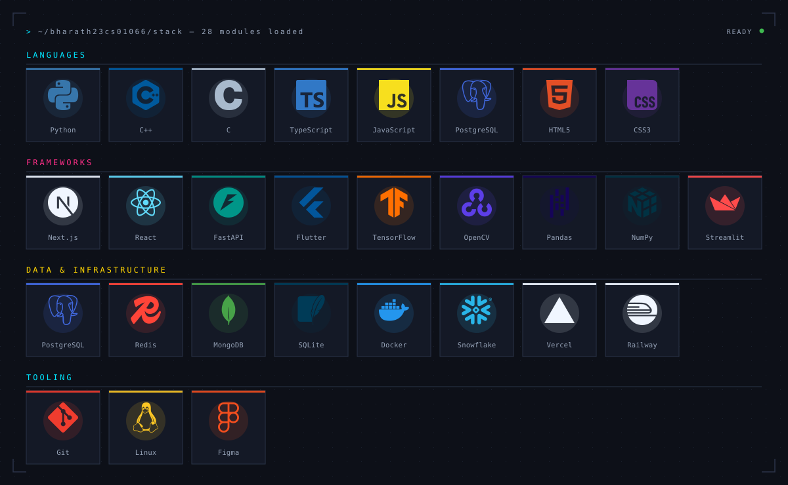

<!--
  Bharath23cs01066/README.md — revision 03
  Ground #0D1018 · panel #141926 · hairline #2A3348 · text #DCE4F0
  Cyan #00E5FF and magenta #FF2E88 lead · green #3FB950 status only
  Animation lives in assets/*.svg — GitHub renders animated SVG through .
  Pending: confirm the LinkedIn and CodeChef URLs.
-->

**SDE Intern at DentNav** — sole engineer across the stack. Next.js, FastAPI, PostgreSQL, live at [dentnav.com](https://dentnav.com). Computer Science at IIT Bhubaneswar, B.Tech '27. Open to SDE, backend and full-stack roles.

<h2></h2>

I'm a passionate skeptic of Artificial Intelligence, Data Visualization enthusiast, Software Development, and other intriguing realms within Computer Science. I love trying to analyze how computers, social networks have affected and continue to affect human psychology and political consciousness.

Gaming is my favorite pastime, particularly grinding Halo Infinite ranked or getting one-tapped in Fortnite once a week. Love watching unnecessarily long game lore videos and reading sci-fi novels that fill in the gaps between game titles.

Some of the responsibilities I hold in college include: mentoring a team at Oracle, a student run journalism club, participating in collegiate level quizzes and MUNs as a core member of the women welfare committee IIT BBS.

I love learning new things and hope to contribute as much as I can in all aspects of college life. Join me on my journey through time on this lonely blue rock we call home in the universe.

<h2></h2>

<table>
<tr>
<td width="50%" valign="top">

**DentNav** — SDE Intern 
`JUN 2026 — PRESENT` · sole engineer

A live platform taking internationally trained dentists through US licensure: AI analysis, paid consultations, gated coursework, and an INBDE exam engine with real-time scoring.

- Whole stack solo — **Next.js 16, FastAPI, PostgreSQL** on Vercel + Railway
- **OpenAI, Google OAuth 2.0, Razorpay and Calendly** in one journey: analyse, sign in, unlock, book a confirmed slot
- Role-gated admin console for doctor onboarding and module entitlements
- Versioned migrations, healthchecks and a test suite behind the deploy

</td>
<td width="50%" valign="top">

**Safe Odisha for Her** — Web Development Intern 
`DEC 2024 — AUG 2025` · NGO

A platform connecting women across Odisha to legal, medical and protection services, led end to end.

- Built the backend and the region-wise **service-mapping layer**
- Normalised datasets across **13 blocks** — police stations, health centres, legal aid, helplines — into one queryable index
- Delivered with civic, legal and technical stakeholders, holding data integrity for a vulnerable user base

</td>
</tr>
</table>

<h2></h2>

<table>
<tr>
<td width="50%" valign="top">

**RAGnROLL** — document intelligence 
`SNOWFLAKE CORTEX · MISTRAL · STREAMLIT · TRULENS`

Snowflake RAG pipeline chunking PDFs on H1–H3 metadata for citation-accurate retrieval across **100+ pages**. Benchmarked **three retrieval configurations** with TruLens and cut per-query cost substantially.

</td>
<td width="50%" valign="top">

**TrinityTix** — distributed ticketing 
`FASTAPI · REDIS · SQLITE · MONGODB ATLAS`

Four services syncing ticket CRUD across **three datastores** with timestamped operation logs and priority-based conflict resolution. Verified commutative, associative, idempotent and convergent merges over **50 concurrent seat transactions**.

</td>
</tr>
<tr>
<td width="50%" valign="top">

**Flexcellent** — pose correction 
`FLUTTER · OPENCV · MEDIAPIPE · PYTEST`

Flutter camera frames streamed every three seconds over async WebSockets into a Python validator. MediaPipe landmarks across **nine asanas** returning three posture states, with **20+ Pytest** cases over extraction, scoring and classification.

</td>
<td width="50%" valign="top">

**Game of Taash** — strategic multiplayer 
`C · RAYLIB · MONTE CARLO`

A card game written in C against Raylib, with **three AI strategies** — randomised, function-based, and Monte Carlo simulation — behind an event-driven UI with card validation and integrated textures.

</td>
</tr>
</table>

<h2></h2>

<h2></h2>

**Editor** · *Oracle*, the student-run journalism body of IIT Bhubaneswar 
`APR 2026 — PRESENT` 
Mentor a reporting team, and write and edit investigative and opinion pieces on institute administration, policy and student affairs.

**Core Team** · *Pravaah*, the annual fest of IIT Bhubaneswar 
`JAN 2025 — APR 2025` 
Ran execution across verticals and led planning for large-scale events including the Startup Expo.

**Assistant Coordinator** · *Women Welfare Committee*, IIT Bhubaneswar 
`MAR 2024 — DEC 2024` 
Organised cycle-training workshops and led International Women's Day execution in 2024 and 2025. Represent the committee in collegiate quizzes and Model UN.

<h2></h2>

| STANDING | EXAMINATION | YEAR |
| :--- | :--- | ---: |
| All India Rank 7 | National Mathematics Talent Contest (AMTI), from 70,000 candidates | 2016 |
| Top 1% nationally | National Standard Examination in Physics | 2022 |
| Top 11 in Telangana | National Standard Examination in Physics | 2020 |
| Qualified, 300 nationwide | Indian National Junior Science Olympiad | 2020 |
| 300 / 390 | BITSAT | 2023 |

Reachable at **23cs01066@iitbbs.ac.in**
